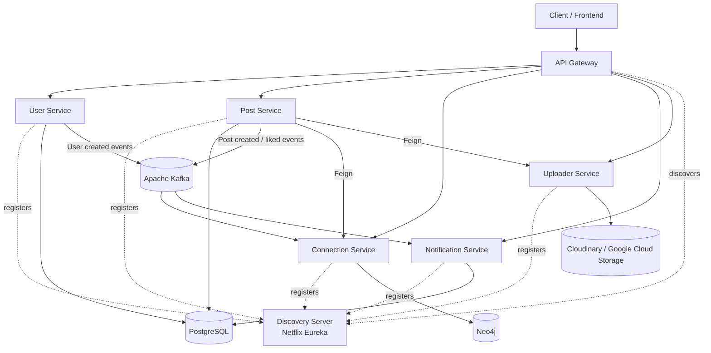

# Professional Distributed Network Platform

A backend-first, distributed professional networking platform inspired by the core architecture of platforms such as LinkedIn.

The project is built as a set of independently deployable Spring Boot microservices, with an API Gateway at the edge, service discovery, asynchronous event-driven communication, dedicated data stores, JWT-based authentication, and file-upload support.

> **Project status:** Backend implementation in progress. The repository currently focuses on the Java/Spring Boot backend; a frontend is not included yet.

---

## Architecture



---

## Services

| Service | Responsibility | Main Technologies |
|---|---|---|
| **API Gateway** | Single entry point, routing and JWT authentication | Spring Cloud Gateway, JWT, Eureka |
| **User Service** | User registration, login and authentication | Spring Boot, PostgreSQL, JPA, JWT, BCrypt |
| **Post Service** | Create and retrieve posts, likes and media references | Spring Boot, PostgreSQL, JPA, Kafka, OpenFeign, MapStruct |
| **Connection Service** | Professional connections and graph-based relationship queries | Spring Boot, Neo4j, Kafka, OpenFeign |
| **Notification Service** | Consumes events and persists user notifications | Spring Boot, Kafka, PostgreSQL, JPA |
| **Uploader Service** | Handles media uploads and returns file URLs | Spring Boot, Cloudinary, Google Cloud Storage |
| **Discovery Server** | Service registration and discovery | Netflix Eureka |
| **Kafbat UI** | Kafka monitoring and administration during development | Kafbat UI |

---

## Core Features

### Authentication & Security

- User signup and login APIs
- Password hashing using BCrypt
- JWT-based authentication
- Gateway-level JWT validation for protected routes
- Authenticated user identity forwarded internally through `X-User-Id`
- Public authentication endpoints separated from protected application routes
- Request validation using Spring Validation

### Professional Connections

The connection service uses **Neo4j** to model relationships as a graph.

Supported operations include:

- Send connection requests
- Accept connection requests
- Reject connection requests
- Retrieve first-degree connections
- Retrieve second-degree connections
- Retrieve third-degree connections

This allows the platform to represent professional relationships naturally as a graph rather than forcing relationship traversal into relational joins.

### Posts & Engagement

The post service currently supports:

- Creating posts
- Retrieving a user's posts
- Retrieving a post by ID
- Uploading optional media with a post
- Like a post
- Unlike a post

Post interactions generate Kafka events for asynchronous processing.

### Event-Driven Notifications

Apache Kafka is used for asynchronous communication between services.

Current event flows include:

```text
User Service
    |
    | user_created_topic
    v
Connection Service
    |
    | connection graph initialization
    v
Neo4j


Post Service
    |
    +---- post_created_topic ----> Notification Service
    |
    +---- post_liked_topic ------> Notification Service
```

The notification service consumes events and persists notification records in PostgreSQL.

### Media Uploads

The uploader service abstracts media storage from the post service.

Supported storage integrations in the backend include:

- **Cloudinary**
- **Google Cloud Storage**

The post service communicates with the uploader service through OpenFeign rather than handling storage-provider logic directly.

---

## Technology Stack

### Backend

- Java 21
- Spring Boot 4.1.1
- Spring Web MVC
- Spring Cloud Gateway
- Spring Cloud Netflix Eureka
- Spring Cloud OpenFeign
- Spring Data JPA
- Spring Data Neo4j
- Spring Kafka
- JWT
- BCrypt
- MapStruct
- Lombok

### Infrastructure & Data

- PostgreSQL
- Neo4j
- Apache Kafka
- Kafbat UI
- Cloudinary
- Google Cloud Storage
- Docker / container images via Jib
- Kubernetes-oriented configuration is included for the services

---

## Communication Patterns

The platform intentionally uses different communication mechanisms depending on the use case.

### Synchronous communication

**API Gateway → Microservices**

Routes external API requests to the appropriate service.

**Microservice → Microservice**

OpenFeign is used where an immediate response is required, for example:

```text
Post Service
    |
    +----> Connection Service
    |
    +----> Uploader Service
```

### Asynchronous communication

Kafka is used for events that do not require the producer to wait for downstream processing.

Examples:

```text
User Created
      ↓
    Kafka
      ↓
Connection Service


Post Created
      ↓
    Kafka
      ↓
Notification Service


Post Liked
      ↓
    Kafka
      ↓
Notification Service
```

This keeps event-driven responsibilities decoupled from the request/response path.

---

## Data Storage Strategy

The project intentionally uses different databases for different data models.

| Data Store | Used By | Purpose |
|---|---|---|
| **PostgreSQL** | User Service | User/account data |
| **PostgreSQL** | Post Service | Posts and likes |
| **PostgreSQL** | Notification Service | Notification records |
| **Neo4j** | Connection Service | Professional relationship graph |
| **Cloudinary / GCS** | Uploader Service | Uploaded media |

This follows a **database-per-service** approach rather than sharing one database across the entire application.

---

## Repository Structure

```text
Project-PL01-LinkedIn/
│
├── apiGateway/
├── discoveryServer/
├── userService/
├── postsService/
├── connectionService/
├── notificationService/
├── uploaderService/
├── kafbatui/
│
└── .gitignore
```

Each backend service is maintained as an independent Spring Boot application with its own Maven configuration.

---

## API Routing

The API Gateway exposes service routes under a common `/api/v1` prefix.

| Gateway Route | Target Service | Authentication |
|---|---|---|
| `/api/v1/users/**` | User Service | Public authentication endpoints |
| `/api/v1/posts/**` | Post Service | JWT protected |
| `/api/v1/connections/**` | Connection Service | JWT protected |
| `/api/v1/uploader/**` | Uploader Service | JWT protected |
| `/api/v1/notification/**` | Notification Service | JWT protected |

The gateway strips the external API prefix before forwarding requests to internal services.

---

## Running Locally

### Prerequisites

Install the following:

- Java 21
- Maven
- PostgreSQL
- Neo4j
- Apache Kafka
- Git

Optional:

- Docker
- Kafbat UI

### 1. Clone the repository

```bash
git clone https://github.com/vaibhav-m-bansode/Project-PL01-LinkedIn.git
cd Project-PL01-LinkedIn
```

### 2. Start infrastructure

Start:

- PostgreSQL
- Neo4j
- Kafka

Create the databases required by the services and configure credentials through environment-specific configuration.

### 3. Start the Discovery Server

```bash
cd discoveryServer
./mvnw spring-boot:run
```

The Eureka server runs on:

```text
http://localhost:8761
```

### 4. Start the microservices

Run each service from its own directory:

```bash
./mvnw spring-boot:run
```

Recommended startup order:

```text
Discovery Server
      ↓
User / Connection / Post / Notification / Uploader Services
      ↓
API Gateway
```

### 5. Access the system through the Gateway

The intended client entry point is the API Gateway rather than calling individual services directly.

---

## Configuration

The repository contains local and Kubernetes-oriented configuration profiles.

For local development, configure:

- PostgreSQL connection details
- Neo4j connection details
- Kafka bootstrap server
- JWT secret
- Cloudinary credentials
- Google Cloud Storage credentials

For Kubernetes deployments, the services contain `application-k8s.yaml` configurations that use environment variables and service DNS names.

**Do not commit real credentials, API keys, JWT secrets, service-account files, or database passwords to Git.**

---

## Containerization

The services use the **Jib Maven Plugin** to build container images without requiring Dockerfiles for each Spring Boot service.

Example:

```bash
./mvnw clean package -DskipTests
```

The Maven build is configured to build service images through Jib.

---

## Kubernetes

Kubernetes-oriented configuration is being developed as part of the project's deployment phase.

The current backend configuration already includes Kubernetes-specific service discovery through internal service names such as:

```text
user-service
post-service
connection-service
notification-service
uploader-service
kafka
```

The long-term deployment target is a containerized microservice architecture running on Kubernetes.

---

## Design Principles

The project is being developed around the following backend and distributed-systems principles:

- **Microservice decomposition** — independent business capabilities
- **Database per service** — service-owned persistence
- **API Gateway pattern** — centralized external routing
- **Service discovery** — dynamic service registration
- **Event-driven architecture** — Kafka-based asynchronous workflows
- **Synchronous service communication** — OpenFeign where immediate responses are required
- **Graph-based relationship modeling** — Neo4j for connection traversal
- **Stateless authentication** — JWT
- **Separation of concerns** — storage, notification, identity, posts and relationships are isolated into separate services
- **Container-first deployment** — services are prepared for container image builds

---

## Current Development Status

### Completed / Implemented

- [x] User signup and login
- [x] JWT authentication
- [x] API Gateway routing
- [x] Eureka service discovery
- [x] User Service
- [x] Post Service
- [x] Post likes / unlikes
- [x] Connection Service with Neo4j
- [x] First-, second- and third-degree connection queries
- [x] Connection request workflow
- [x] Kafka event publishing and consumption
- [x] Notification Service
- [x] Media upload service
- [x] Cloudinary integration
- [x] Google Cloud Storage integration
- [x] OpenFeign service communication
- [x] Jib-based container image configuration
- [x] Kubernetes-oriented application configuration

### Planned

- [ ] Frontend application
- [ ] Complete Kubernetes manifests
- [ ] Production deployment
- [ ] CI/CD pipeline
- [ ] Distributed tracing and centralized observability
- [ ] API documentation with OpenAPI / Swagger
- [ ] Comprehensive automated integration testing

---

## Why This Project?

This project is primarily a hands-on exploration of **backend engineering and distributed systems**.

The goal is not simply to reproduce a social networking UI, but to understand how a professional networking platform can be decomposed into independently deployable services and how those services communicate through synchronous APIs and asynchronous events.

Key areas explored include:

- Microservices architecture
- Authentication and authorization
- Service discovery
- API Gateway design
- Kafka event-driven systems
- Graph databases
- Inter-service communication
- Distributed data ownership
- Containerization
- Kubernetes deployment architecture

---

## Author

**Vaibhav Bansode**

Backend-focused developer working with Java, Spring Boot, REST APIs, SQL, PostgreSQL and distributed systems.

---

## License

This project is currently intended for learning and portfolio purposes.
